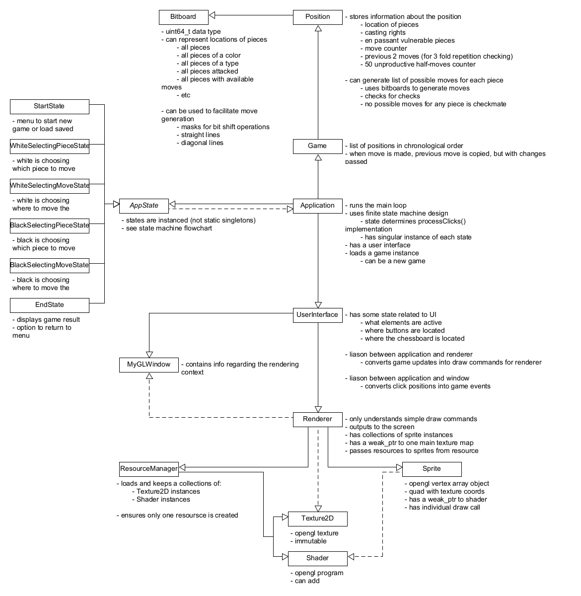

# BitChess (in development)
Version 0.1.1
- See [Changelog](#changelog)
- See [Chess Programming Resources](https://github.com/chopndolphy/BitChess/blob/refactor/doc/Resources.md "Essential information for understand the BitChess source code")
## Getting Started
BitChess is a 16-bit-style local-two-player chess-game, made with OpenGL. The project is intended as a portfolio piece and a educational tool for learning game development, specifically game engine architecture and 2D graphics programming.
### Building and Running
BitChess is currently only available for linux and requires GLFW 3.4 or later to be installed
<https://github.com/glfw/glfw>

<https://www.glfw.org/docs/latest/compile.html>

After GLFW is installed, from the terminal, navigate to the BitChess project directory and enter:
```
make
```
to compile the application.
Alternatively, to compile (if it needs to be compiled) and run the program, enter:
```
make run
```
Finally, if you wish to recompile from scratch, you can enter:
```
make clean
```
to delete the entire build directory (it will be remade upon recompilation).
### Controls
- Mouse controls
- Escape to exit the program
## <a name="changelog"></a> Changelog
### 0.1.0
- Major refactor is in process. See [application architecture diagram](#apparch) and [state machine flowchart](#stateflo) for a tentative intended outcome
- Basic GUI is implemented
- Only simple pawn movement is implemented
- Custom pixel art for the board, pieces, chessboard UI elements, and cursor. More to come later
## Bugs
- Cannot resize (unresizable on purpose: need to implement custom window decorations and custom resizing, because wsl is broken)
- Stack smashing on exit
## To-Do
- Finish architectural refactor
    - Bitboard
    - Position
    - Game
    - UserInterface
    - Make ResourceManager not static (owned by Renderer2D)
- Implement the rest of the game logic
- Second framebuffer for more robust mouse-picking
- Custom window decorations
- Start state
    - New game
    - Load game
    - Adjust audio
    - Change color scheme
    - Quit
- End state
    - Return to start menu
    - Quit
- Audio system
- Make UI and background art
- Monitor handling
- Pause menu
    - Save game
    - Adjust audio
    - Return to start menu
    - Quit
- Windows version???
- Better package installation process
## Documentation
### <a name="apparch"></a> Application Architecture

### <a name="stateflow"></a> State Machine Flowchart
